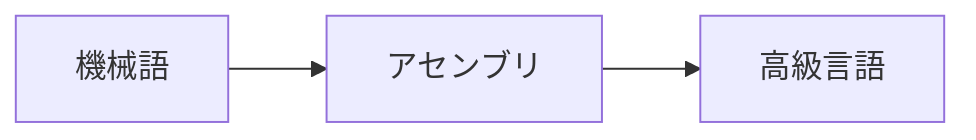

## 時代の流れ

だんだんと人間がわかりやすい言葉になってきた。特に、高級言語では数学の計算式によく似ているため、一般人でも理解しやすい。  
しかし、プログラミングの生産生や品質の向上よりもコンピュータの普及と発展が爆発的に進んでしまった。  
そこで、さらに<u>プログラムをわかりやすくする</u>**構造化プログラミング**と<u>保守性を上げる</u>**サブルーチンの独立性**に焦点があてられました。

## 構造化プログラミング
基本理念:「正しく動作するプログラムを作成するためには、わかりやすい構造にすることが重要である」  
GOTO分を廃止し、**基本三構造**(**順次・条件分岐・繰り返し**)で表現する。  
プログラムサイズや速度などの点で懸念されたが、ハードウェアの進歩により無視できるようになった。

## サブルーチンの独立性
サブルーチンは黎明期から存在はしており、プログラムの作成の手間を減らしたり、プログラムサイズを小さくするためのものだった。  
しかし、この時代ではサブルーチンがグローバル変数の情報を読み書きしており、プログラムの保守が難しい原因だった。  
そこで、**ローカル変数**と**引数の値渡し**が考案されました。

## C言語について
サブルーチンの独立性と構造化プログラミングの仕組みを持たせた高級言語
- アセンブリでしかできなかったビット演算やポインタなどの細かな機能を備えていた
- 必要な機能を言語使用にせずに、関数ライブラリで組み上げるようにしました
