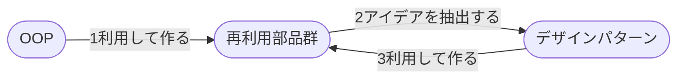

# ソフトウェアとアイデアの再利用
## 発展の歴史

## クラスライブラリ
汎用的な機能を持つクラスをたくさん集めたもの

従来 → 「呼び出して」利用する  
OOP → 呼び出すだけではない
- クラスからインスタンスを生成、メソッドと変数定義をまとめて利用する
- ライブラリ内の呼び出される側ロジックをアプリ固有の処理で置き換える
- ライブラリ内のクラスにメソッドや変数を追加定義して新しいクラスを生成する

### 標準のクラスライブラリ
言語仕様を最小限にして必要な機能を標準クラスライブラリとして提供している   
→ もはや言語仕様の一部として見ることができるよね

例) 文字列処理、算術計算、日付計算、ファイル処理、GUI、データベース処理、通信

### Objectクラス
- すべてのクラスの継承構造の最上位に位置するクラス  
- どんなクラスでも有用なメソッドを提供している

## フレームワーク
定義は曖昧
- 包括的なアプリケーション基盤
  - 開発・実行環境やベンダー製品のコンセプト
    - Webアプリケーションフレームワーク
    - .NETフレームワーク
    - MVCフレームワーク
- 特定の目的のために書かれた再利用部品群
  - 特定の目的を果たすためのアプリケーションの半完成品

### 特定の目的のために書かれた再利用部品群としてのフレームワーク
特定の目的を果たすためのアプリケーションの半完成品

フレームワークを呼び出すのではなく、フレームワークからアプリケーションを呼び出す  
→ **ハリウッド原則**
- Don't call us, we will call you
- すべての流れはフレームワークが決めていてアプリケーション側の処理はポリモーフィズムを使って必要な時に呼び出す

## コンポーネント
定義
- OPPのクラスよりも粒度が大きい
- ソースコード形式ではなくバイナリ形式
- コンポーネントの定義情報を含めて提供
- 機能の独立性が高く、内部の詳細を知らなくても利用できる

GUIを用いて(プロパティやドラッグ&ドロップ)開発する技術
- Visual Basic
- **Unity!!!!**

## デザインパターン
設計アイデアの再利用

GoFのデザインパターン
23種類

デザインパターンが分かると開発者の意図が汲み取れる
